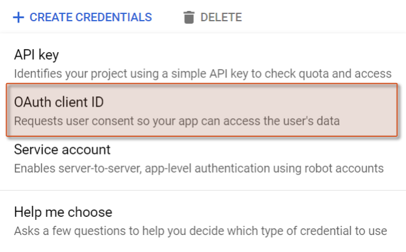
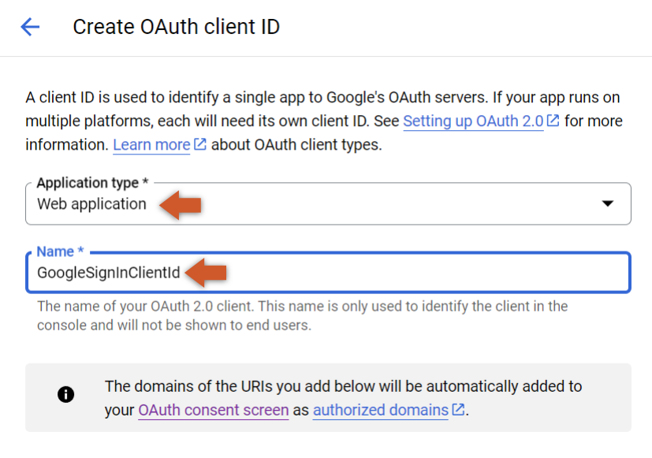
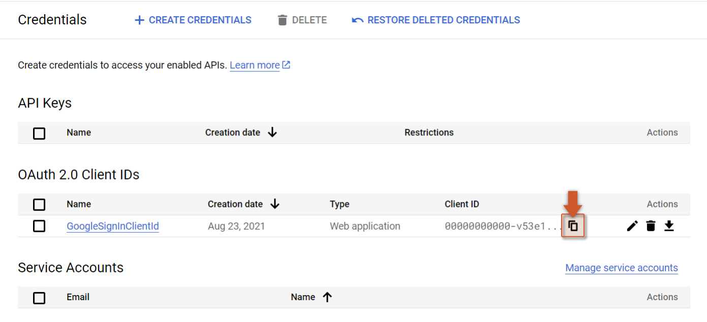

@title Setup

The Google Sign In extension requires the developer to provide the web client Id for the project
the user is signing In to. To get this identifier the user can follow the following steps:

1. Go to Google Cloud Platform [Credentials and APIs](https://console.cloud.google.com/apis/credentials) page and select your project.

2. On the top of the screen click to Create Credentials

3. Select the OAuth client ID option from the dropdown.

4. For application type select Web Application and then give your OAuth client ID a name.

5. Done, you should now be ready to use the Google SignIn Extension by providing the ID that can be found in the image below (click in the icon to copy the Web Client ID).

> [!IMPORTANT]
> When entering the Client ID into the extension options make sure you remove the extra `".apps.googleusecontent.com"` and only provide the UUID.

## Play App Signing

When testing your game on an attached Android device with [Play App Signing](https://support.google.com/googleplay/android-developer/answer/9842756) enabled, you may run into the error `10: Developer console is not set up correctly`. This can be solved by deploying the export to a release track and downloading the app from Google Play. This downloaded app will be signed with the correct keystore signature.